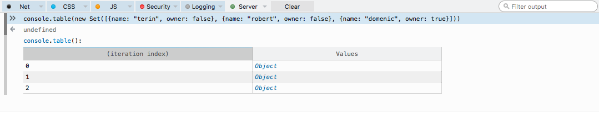
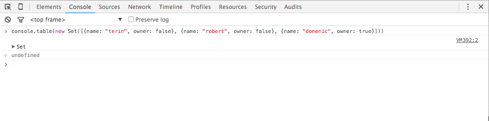
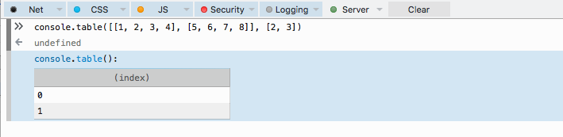
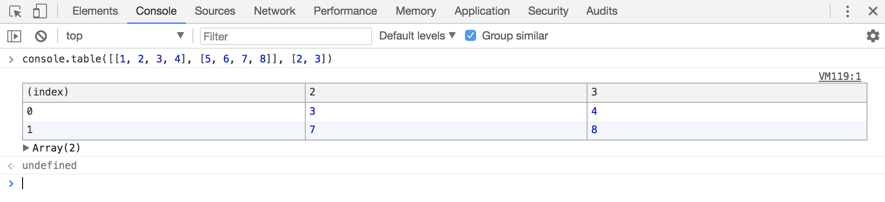
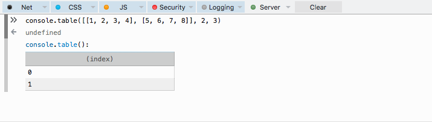
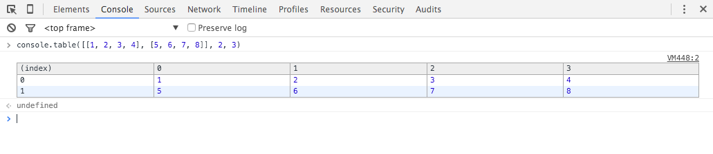

# Found differences

documenting the current status of affairs

## float formatter

```
FF:

console.log("%f", 23)
23,000000

Chrome:

console.log("%f", 23)
23
```

```
FF:

console.log('bjoern and robert are born on the %fst dec', 1.234)
bjoern and robert are born on the 1,234000st dec

Chrome:

console.log('bjoern and robert are born on the %fst dec', 1.234)
bjoern and robert are born on the 1.234st dec
````

```
FF:

console.log("%f", null)
0,000000

Chrome:

console.log("%f", null)
NaN
```

## integer formatter

```
FF:

console.log("%d", null)
0

Chrome:

console.log("%d", null)
NaN
```

```
FF:

console.log('bjoern and robert are born on the %dst dec', "foo")
bjoern and robert are born on the 0st dec

Chrome:
console.log('bjoern and robert are born on the %dst dec', "foo")
bjoern and robert are born on the NaNst dec
```

## not enough arguments to interpolate all placeholders

```
FF:

console.log("%s %snewword", "duck")
duck newword

Chrome:

console.log("%s %snewword", "duck")
duck %snewword
```

## console.assert

```
FF / Edge:

console.assert(false, "robert keeps %s on his balcony", "plaices")
robert keeps plaices on his balcony

Chrome:

console.assert(false, "robert keeps %s on his balcony", "plaices")
Assertion failed: robert keeps %s on his balcony plaices
```


## console.assert

```
FF / Edge:

console.assert(false, "robert keeps %s on his balcony", {foo: "bar"})
robert keeps [object Object] on his balcony

Chrome:

console.assert(false, "robert keeps %s on his balcony", {foo: "bar"})
Assertion failed: robert keeps %s on his balcony Object {foo: "bar"}
```

## console.table - printing of strings

```
FF:

console.table("the plaice living on the balcony")
undefined
console.table():

Chrome:
console.table("the plaice living on the balcony")
the plaice living on the balcony
undefined
```


## console.table - Sets

FF:

```js
console.table(new Set([{name: "terin", owner: false}, {name: "robert", owner: false}, {name: "domenic", owner: true}]))
```



Chrome:

```js
console.table(new Set([{name: "terin", owner: false}, {name: "robert", owner: false}, {name: "domenic", owner: true}]))
```




## console.table - Indexes

FF:

```js
console.table([[1, 2, 3, 4], [5, 6, 7, 8]], [2, 3])
```




Chrome:

```js
console.table([[1, 2, 3, 4], [5, 6, 7, 8]], [2, 3])
```




## console.table - Multiple Arguments


FF:

```js
console.table([[1, 2, 3, 4], [5, 6, 7, 8]], 2, 3)
```




Chrome:

```js
console.table([[1, 2, 3, 4], [5, 6, 7, 8]], 2, 3)
```


