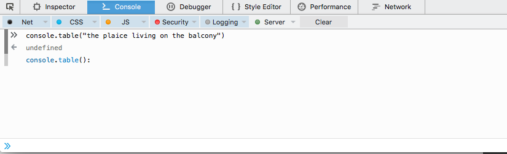
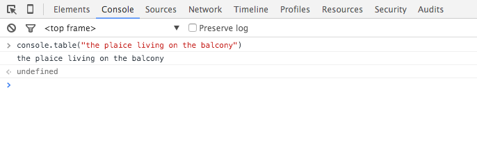

# Found differences

documenting the current status of affairs

## float formatter

```
FF:

console.log("%f", 23)
23,000000

Chrome:

console.log("%f", 23)
23
```

```
FF:

console.log('bjoern and robert are born on the %fst dec', 1.234)
bjoern and robert are born on the 1,234000st dec

Chrome:

console.log('bjoern and robert are born on the %fst dec', 1.234)
bjoern and robert are born on the 1.234st dec
````

```
FF:

console.log("%f", null)
0,000000

Chrome:

console.log("%f", null)
NaN
```

## integer formatter

```
FF:

console.log("%d", null)
0

Chrome:

console.log("%d", null)
NaN
```

```
FF:

console.log('bjoern and robert are born on the %dst dec', "foo")
bjoern and robert are born on the 0st dec

Chrome:
console.log('bjoern and robert are born on the %dst dec', "foo")
bjoern and robert are born on the NaNst dec
```

## not enough arguments to interpolate all placeholders

```
FF:

console.log("%s %snewword", "duck")
duck newword

Chrome:

console.log("%s %snewword", "duck")
duck %snewword
```

## console.assert

```
FF / Edge:

console.assert(false, "robert keeps %s on his balcony", "plaices")
robert keeps plaices on his balcony

Chrome:

console.assert(false, "robert keeps %s on his balcony", "plaices")
Assertion failed: robert keeps %s on his balcony plaices
```


## console.assert

```
FF / Edge:

console.assert(false, "robert keeps %s on his balcony", {foo: "bar"})
robert keeps [object Object] on his balcony

Chrome:

console.assert(false, "robert keeps %s on his balcony", {foo: "bar"})
Assertion failed: robert keeps %s on his balcony Object {foo: "bar"}
```

## console.table - printing of strings

FF:

```js
console.table("the plaice living on the balcony")
```




Chrome:

```js
console.table("the plaice living on the balcony")
```




## console.table - Sets

FF:

```js
console.table(new Set([{name: "terin", owner: false}, {name: "robert", owner: false}, {name: "domenic", owner: true}]))
```


Chrome:

```js
console.table(new Set([{name: "terin", owner: false}, {name: "robert", owner: false}, {name: "domenic", owner: true}]))
```


## console.table - Indexes

FF:

```js
console.table([[1, 2, 3, 4], [5, 6, 7, 8]], [2, 3])
```


Chrome:

```js
console.table([[1, 2, 3, 4], [5, 6, 7, 8]], [2, 3])
```


## console.table - Multiple Arguments


FF:

```js
console.table([[1, 2, 3, 4], [5, 6, 7, 8]], 2, 3)
```


Chrome:

```js
console.table([[1, 2, 3, 4], [5, 6, 7, 8]], 2, 3)
```


## console.count - counters and label repetition

Edge:

```
console.count('foo')
undefined
foo:           2
console.count('foo')
undefined

Chrome:

console.count('foo')
foo: 1
undefined
console.count('foo')
foo: 2
undefined


FF:

console.count('foo')
foo: 1
undefined
console.count('foo')
foo: 2
undefined
```

*Edge: the counter is raised where the first label `foo` is printed*
<br/>
*FF/Chrome: the label is printed multiple times with the current counter*


## console.count - Arrays

Edge:

```
console.count({})
undefined
[object Object]: 1

console.count([])
undefined
:           1

Chrome:

console.count({})
[object Object]: 1
undefined

console.count([])
: 1
undefined

FF:

console.count({})
[object Object]: 1
undefined

console.count([])
<no label>: 1
undefined
```

*`<no label>` appears in FF*

## console.count - no arguments

```
Edge:
console.count()
undefined
: 1

Chrome:

console.count()
: 1
undefined

FF:

console.count()
<no label>: 1
undefined
```

*`<no label>` appears in FF*


## - no arguments / empty strings


```
Edge:

console.count()
: 1
undefined

console.count("")
: 1
undefined


Chrome:

console.count()
: 1
undefined

console.count("")
: 2
undefined


FF:

console.count()
<no label>: 1
undefined
console.count("")
<no label>: 2
undefined
```

*Chrome/FF count no-arguments and empty-string as the same counter, FF adds `<no label>`.*
<br>
*Edge counts empty-string and no-arguments separetely*

## console.count - null

Edge:

```
console.count(null)
undefined
: 2

Chrome:

console.count(null)
null: 2
undefined

FF:

console.count(null)
null: 1
undefined
```

*Edge has no label*

## console.count - undefined

```
Edge:

console.count(undefined)
: 1
undefined


Chrome:

console.count(undefined)
undefined: 1
undefined

FF:

console.count(undefined)
undefined: 1
undefined
```

*Edge has no label*
